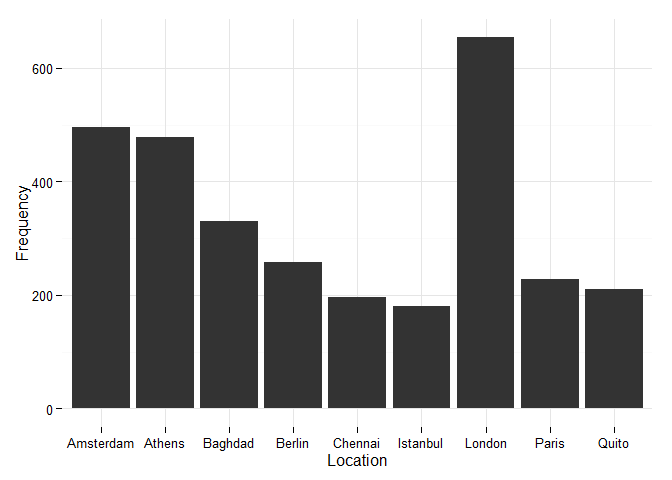

# Analysis of Twitter data on Syrian Refugee crisis
TawsifKhan  
October 26, 2015  

Update- Look up Xia's cool project. He used my scapper :)

https://github.com/Elixeus/infoviz_refugee_project


Here I will use Python and R to analyze tweets regarding the Syrian Refugee crisis. I would like to see which countries are most active in terms of such tweets, and also what are the most popular words corresponding to each country.

I am currently using the following filter:

```python
twitterStream.filter(track=["syria" or "refugee" or "syrian" or "migrant crisis"])
```

Most of the tweets are not geo-tagged, but some come with a location tag and a time-zone. I have tried to map those to a country. I am still working on it to make it reliable. 

Since I have been into some Hadoop lately, I used MapReduce concept to count the words. So in the terminal the following does the job for me (for now):


```python
less twitDB.csv | ../src/mapper.py | sort | ../src/python
```

I chose R for the analysis.


```r
summary(df)
```

```
##       Word           Location        Count        
##  syria  :  90   Canada   :1130   Min.   :  1.000  
##  https  :  78   London   : 413   1st Qu.:  1.000  
##  http   :  51   Amsterdam: 320   Median :  1.000  
##  russian:  36   Athens   : 279   Mean   :  2.127  
##  russia :  32   Baghdad  : 149   3rd Qu.:  1.000  
##  isis   :  31   (Other)  :3152   Max.   :264.000  
##  (Other):5986   NA's     : 861
```
As you can see the location is still a mixture of cities and countries. And the high count of Canada makes me think that is a reason of me being in Canada. But moving on...

So we get the top locations and words.


```r
top_ten_locations
```

```
##     Location   x
## 64    London 654
## 9  Amsterdam 496
## 11    Athens 478
## 14   Baghdad 330
## 19    Berlin 258
## 74     Paris 228
## 76     Quito 210
## 33   Chennai 196
## 53  Istanbul 181
```

Use ggplot to plot some bars.


```r
library(ggplot2)
p1 <- ggplot(data=top_ten_locations,aes(x=Location,y=x))
p1 <- p1 + geom_bar(stat="identity",size=1) + ylab("Frequency")
p1 <- p1 + theme_minimal()
p1
```

 

More to follow.
