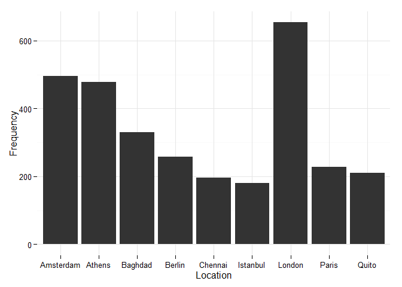

# Analysis
TawsifKhan  
October 26, 2015  


```r
summary(df)
```

```
##       Word           Location        Count        
##  syria  :  90   Canada   :1130   Min.   :  1.000  
##  https  :  78   London   : 413   1st Qu.:  1.000  
##  http   :  51   Amsterdam: 320   Median :  1.000  
##  russian:  36   Athens   : 279   Mean   :  2.127  
##  russia :  32   Baghdad  : 149   3rd Qu.:  1.000  
##  isis   :  31   (Other)  :3152   Max.   :264.000  
##  (Other):5986   NA's     : 861
```


```r
top_ten_location
```

```
##     Location   x
## 64    London 654
## 9  Amsterdam 496
## 11    Athens 478
## 14   Baghdad 330
## 19    Berlin 258
## 74     Paris 228
## 76     Quito 210
## 33   Chennai 196
## 53  Istanbul 181
```

```r
p1 <- ggplot(data=top_ten_location,aes(x=Location,y=x))
p1 <- p1 + geom_bar(stat="identity",size=1) + ylab("Frequency")
p1 <- p1 + theme_minimal()
p1
```

 
